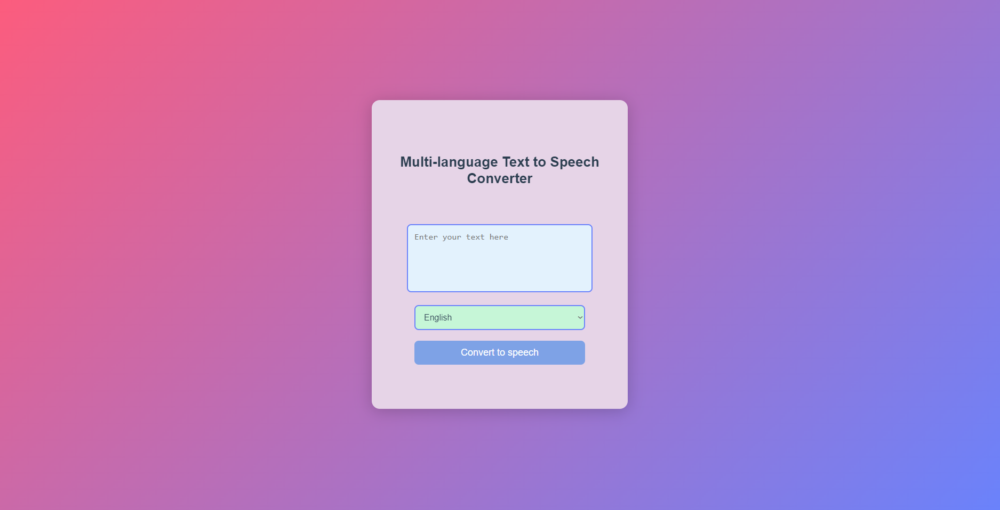
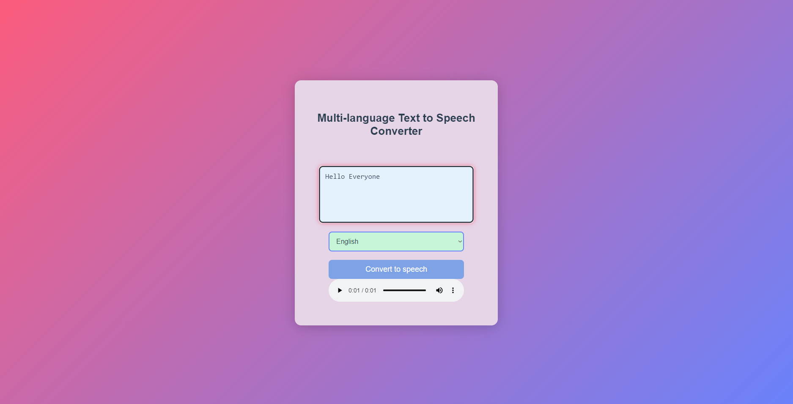

# Multi-language Text-to-Speech Converter

A Flask-based web application that converts text into speech in multiple languages using Google Text-to-Speech (gTTS). The app provides a simple interface for users to input text, select a language, and generate audio output.





---

## **Features**
- Supports text-to-speech conversion for multiple languages (e.g., English, Hindi).
- Clean and responsive user interface.
- Instant audio playback after conversion.
- Easily extensible to add more languages.

---

## **Technologies Used**
- **Backend:** Flask
- **Frontend:** HTML, CSS, and JavaScript
- **Text-to-Speech Engine:** gTTS (Google Text-to-Speech)

---

## **Setup Instructions**
### Prerequisites
Ensure you have Python 3.8+ and `pip` installed on your system.

### Steps to Run Locally
1. Clone the repository:
   ```bash
   git clone https://github.com/Ayushpremrocks/Multi-language-Text-To-Speech

2. Create a Virtual Environment (Optional but Recommended):
   ```bash
   python -m venv venv
   source venv/bin/activate    # On macOS/Linux
   venv\Scripts\activate       # On Windows


3. Install dependencies:
   ```bash
   pip install -r requirements.txt
   
4. Run the Flask app:
   ```bash
   python app.py

5. Open your browser and go to:
   ```bash
   http://127.0.0.1:5000
---
### How to Check Flask Installation and Version
1. **Verify Flask Installation:** Run the following command in your terminal
   ```bash
   python -m flask --version
   ```
   If Flask is installed, you will see output similar to this:
   ```bash
   Flask 2.3.3
   Python 3.x.x

2. **If Flask is Not Installed:** Install Flask using:
   ```bash
   pip install Flask
   ```
---

## License

This project is licensed under the MIT License - see the [LICENSE](LICENSE) file for details.
